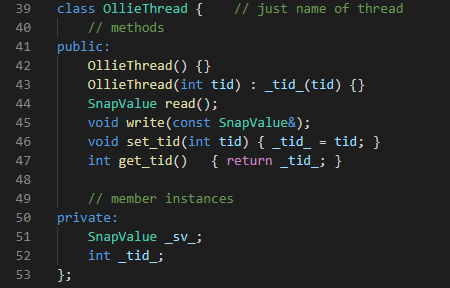

# Wait-free snapshot
This is the subject to implement Wait-free snapshot algorithm for concurrent programming. We need to apply the principles of the lecture we took.

## What is Wait-free?
An algorithm is wait-free if every operation has a bound on the finite steps the algorithm will take before the operation completes. This property is critical for real-time systems and is always nice to have as long as the performance cost is not too high.

## What is snapshot?
Snapshot is an algorithm to guarantee the work of a thread is linearizable in non-blocking algorithm. It writes resulting snapshot together with doing the job. For this, scan is occurred between short time interval and checks that the values were not changed. Scan can not only starve but also take the job's snapshot. In this subject, the job is updating each thread's value.

## Objective
To implement wait-free snapshot algorithm to parallelize threads, based on the lecture we took. And evaluate the performances along the numbers of threads; 1, 2, 4, 8, 16, and 32 for a minute.

## Working Environment:  
- Oracle VM Virtual Box
- 4 processors
- 2048 MB for memory
- OS: Ubuntu 20.04 LTS

## Run tasks
`$make`  
`$./run N`  
Note: N is the integer number which represents the number of threads.

# Code implement
## introduction
  
I declared several functions and structures in "my_thread.h" file. I tried to use boost library but it was unnecessary any more. The functions that are related on threadpool and boost io were implemented but not used.

## custom structures
### SnapValue structure
  
I implemented SnapValue data structure that appears in the lecture. I also added constructors and operation = overloading, because of implementing to read data with managing the memory well.

### OllieThread class
  
Olliethread is a thread for representing wait-free snapshot with write and read.

## implementation detail
### read and write of thread
  
By the implementation of the SnapValue constructor, it became very simple to read. Write was also similar to the constructor so that I could apply it at OlliThread's methods.

### collect and get_values
  
They are very similar to each other and I was aware of new operator for managing the memory.

### operator= overloading
![operator]imgs/operator.PNG)  
It helps read() operation with free-ing to manage existing heap memory. It also prevents core dump exception and memory lick.

### scan function
  
The most important portion of this subject is here. As soon as old_copy collects the snapshot values of threads, new_copy tries to collect the snapshot values of threads. And then compare their labels and break out only if there was no changed(moved).  
After break the while loop, save the new_copy values as return value before free memories of that local pointers are pointing.

### update function
  
The update function looks little dirty, because I needed to check the error of core dump. And you can check the values updated with PrintOllie() function.

# Performance Analysis
I experimented two kind of tasks, one is just counting the number of updates by threads, and another is checking the performance with printing the progress during updating by threads.  

## Task 1 - Just counting and estimating times
* [# of threads = 1]  48,529,002 times/min
* [# of threads = 2]  38,004,762 times/min
* [# of threads = 4]  27,053,224 times/min
* [# of threads = 8]  16,779,153 times/min
* [# of threads = 16]  8,626,070 times/min
* [# of threads = 32]  3,358,513 times/min

## Task 2 - Counting with printing
  
* [# of threads = 1]  13,677,349 times/min
* [# of threads = 2]  12,723,251 times/min
* [# of threads = 4]  9,738,648 times/min
* [# of threads = 8]  7,040,675 times/min
* [# of threads = 16]  4,411,990 times/min
* [# of threads = 32]  2,117,093 times/min

## Comparison with chart
  

# Conclusion
The performance was decreasing along the number of threads increases. I guess if the number of threads is smaller, the probability of breaking its linerizability is bigger because the snapshot would be broken easier than the smaller's and the time complexity of scan follows O(N), where N is the number of threads.  
In addition, Task 2 shows that its performance is always worse than Task 1. However, the variance of the performance decreasing of Task 2 is much smaller than Task 1's.

# Discussion
I tried to use Boost_Asio C++ library, and it worked but was heavy to virtual machine. I guess it works better than no using because the difference between Task 1 and Task 2 is I/O-service, so the library could resolve that problem even using I/O service.
